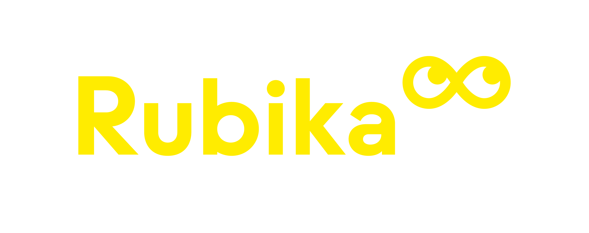

# {style="height:58px; background:#232323;"} Ramses - Rubika Student User Guide

!!! Note
    This is the documentation with specific information for **Rubika Supinfocom** students when using Ramses.  
    [The complete Ramses documentation is available here](http://ramses.rxlab.guide).

## Table of Contents

### Installation and Connection

- [**Install and Update**](install.md)
- [**Connection and Log in**](login.md)

### Maya

- [**Maya**](maya.md)
- [**Maya scripting and automation**](maya_script.md)

### F.A.Q.

- [**Frequently Asked Questions**](https://qa.rxlaboratory.org)

## License

### Software

The software this documentation is referring to is licensed under the ***GNU General Public License***.

**Copyright (C)  2020-2024 Nicolas Dufresne and Contributors.**  
This program is free software; you can redistribute them and/or modify them under the terms of the GNU General Public License as published by the Free Software Foundation; either version 3 of the License, or (at your option) any later version.

This program is distributed in the hope that it will be useful, but WITHOUT ANY WARRANTY; without even the implied warranty of MERCHANTABILITY or FITNESS FOR A PARTICULAR PURPOSE. See the GNU General Public License for more details.

You should have received a copy of the *GNU General Public License* along with this program . If not, see [http://www.gnu.org/licenses/](http://www.gnu.org/licenses/).

{: style="height:75px;"} {: style="height:50px;"}

### Icons and other graphical elements

All graphical elements, especially icons, are from [***RxUI***](http://rxui.rxlab.guide) by Nicolas Dufresne and [RxLaboratory](https://rxlaboratory.org) are licensed under [CC BY-NC-SA 4.0](https://creativecommons.org/licenses/by-nc-sa/4.0/).

**Copyright (C) 2021-2024 Nicolas Dufresne and Contributors.**

[{: style="height:35px;"} {: style="height:35px;"} {: style="height:35px;"} {: style="height:35px;"}](https://creativecommons.org/licenses/by-nc-sa/4.0/)

### This Documentation

**Copyright (C)  2024 Nicolas Dufresne and Contributors.**  
Permission is granted to copy, distribute and/or modify this document under the terms of the GNU Free Documentation License, Version 1.3 or any later version published by the Free Software Foundation;  
with no Invariant Sections, no Front-Cover Texts, and no Back-Cover Texts.
A copy of the license is included in the section entitled "[Documentation License](licenses/gfdl.md)".

{: style="height:75px;"} {: style="height:50px;"}

