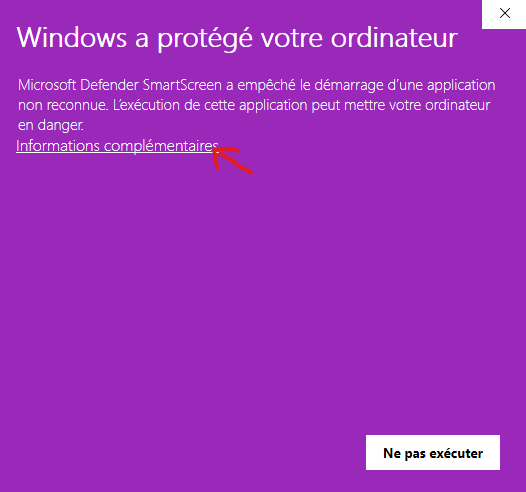
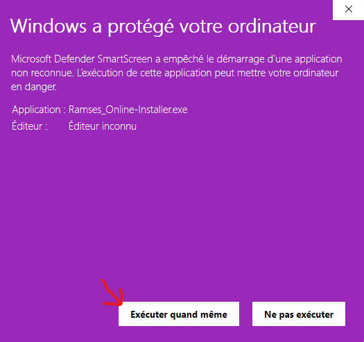
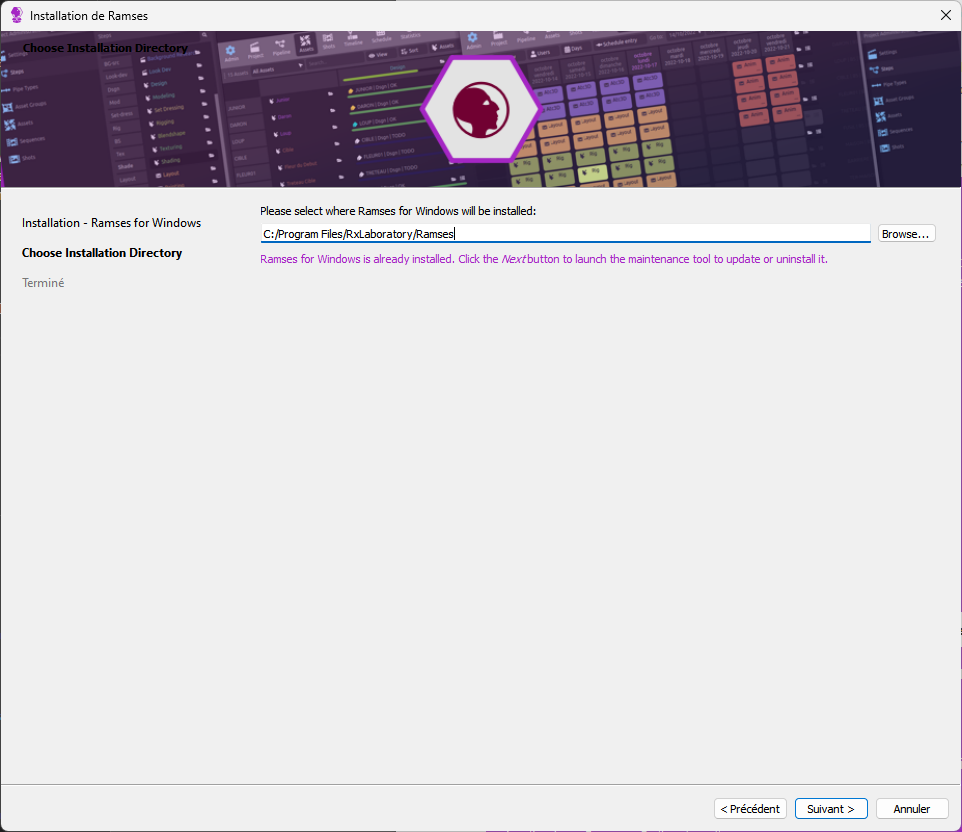
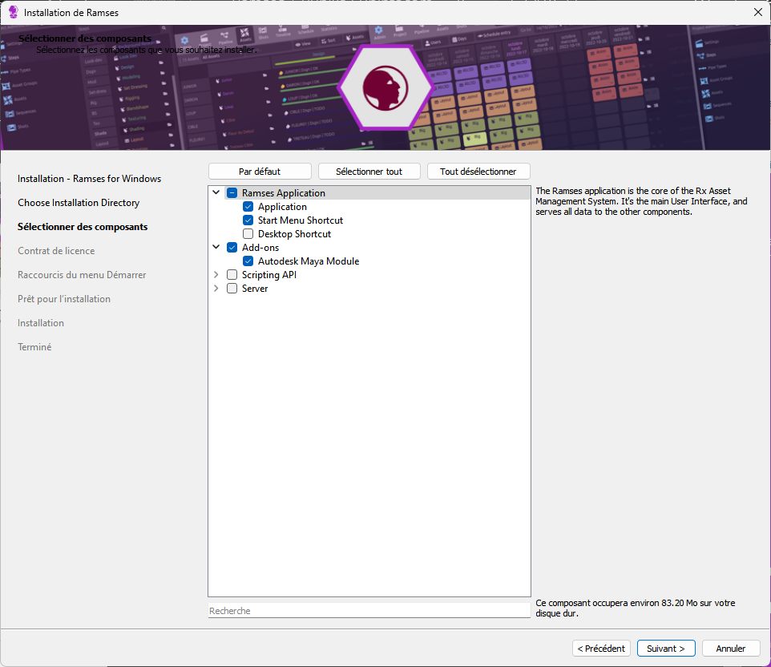
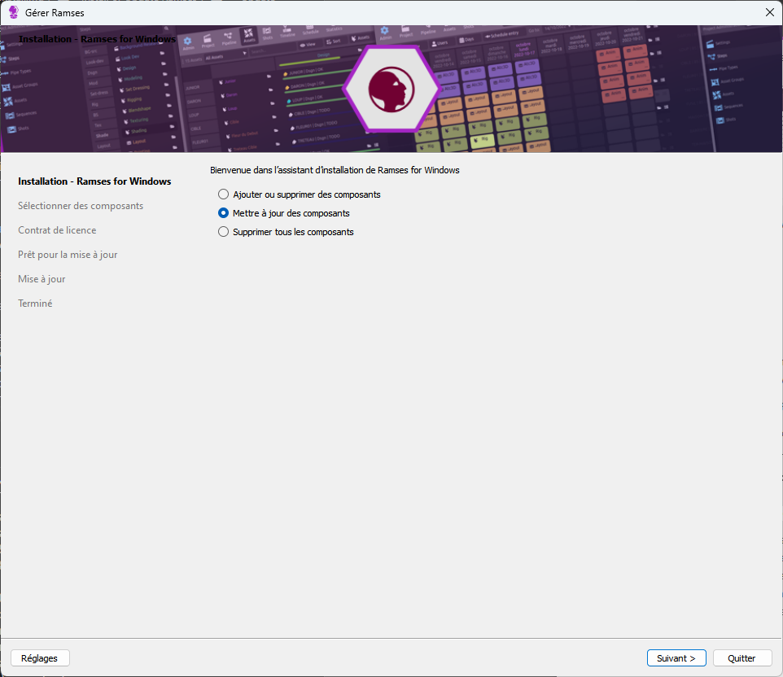

# Install or Update Ramses

## First installation / Re-Installation

Follow these instructions if you're installing Ramses for the first time, or if something is not working correctly and you're trying to clean/fix everything.

1. [**Download the Ramses Installer**](https://github.com/RxLaboratory/Ramses/releases/download/v0.8-Beta/Ramses_Online-Installer.exe). Use exclusively this link, do not use the public links available on *rxlaboratory.org*: you have an exclusive access to this installer to make things simpler for you.

2. Make sure Ramses is not already installed. To be sure, go to the standard installation path: `C:\Program Files\RxLaboratory\Ramses`. If this folder exists and contains some files, **close Maya** and **remove this folder** before re-installing Ramses.

3. **Run the installer** you've downloaded. The Windows *User Access Control* may prevent the execution of the installer, in this case just click the "more info" link to run it anyway.  
    [{style="height:150px;"}](img/installer/uac1.png) [{style="height:150px;"}](img/installer/uac2.png)

4. **Follow the steps** of the installation process. Do not change the default installation path and don't forget to install the Maya Add-on too!  
    [{style="height:150px;"}](img/installer/path.png) [{style="height:150px;"}](img/installer/components.png)  

That's all, the Ramses App should now be available in the Windows Start Menu and it should be available in Maya.

## Update

When running the Ramses application or using the Maya Add-on, there may be a popup window to warn you an update is available; You will also be notified through your *Discord* server.

In this case, it is important to update Ramses without waiting.

1. **Do not** click the *Download* button from the Ramses application or the Maya Add-on, as they're public links, but we're using a private and exclusive installer.

2. Instead, open the **Ramses Maintenance Tool**. You should find it in the Windows Start Menu. If that's not the case, you should find it in the default installation folder: `C:\Program Files\RxLaboratory\Ramses`.

3. In some cases, after a Windows update for example, the maintenance tool may not work properly. In this case, follow the procedure described above in *First installation / Re-Installation*. Otherwise, just select *update components* in the maintenance tool. In some cases, some components may be disabled: that means you'll have to run the update procedure twice because the maintenance tool can't update all components at once.  
    [{style="height:150px;"}](img/installer/update.png)
