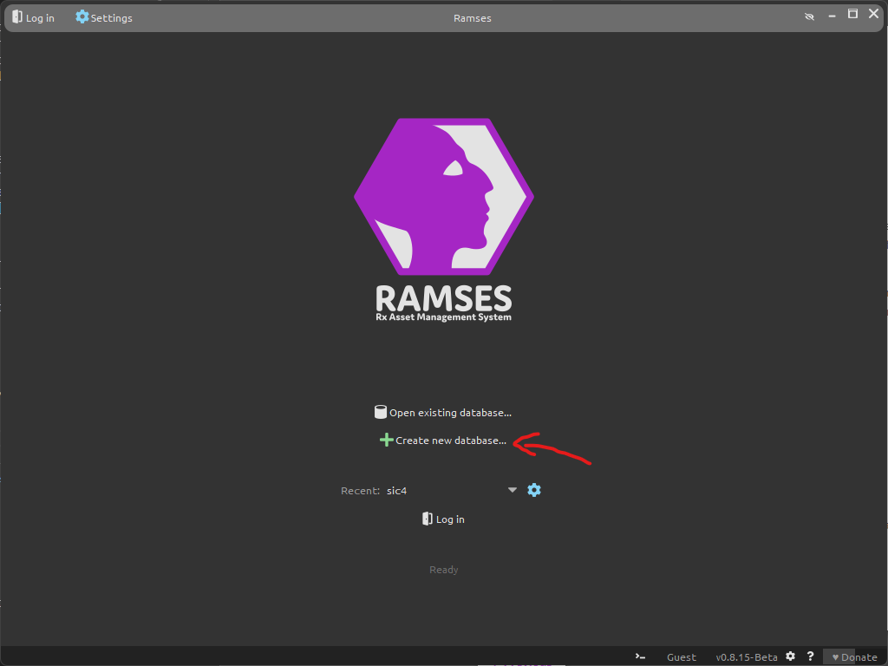
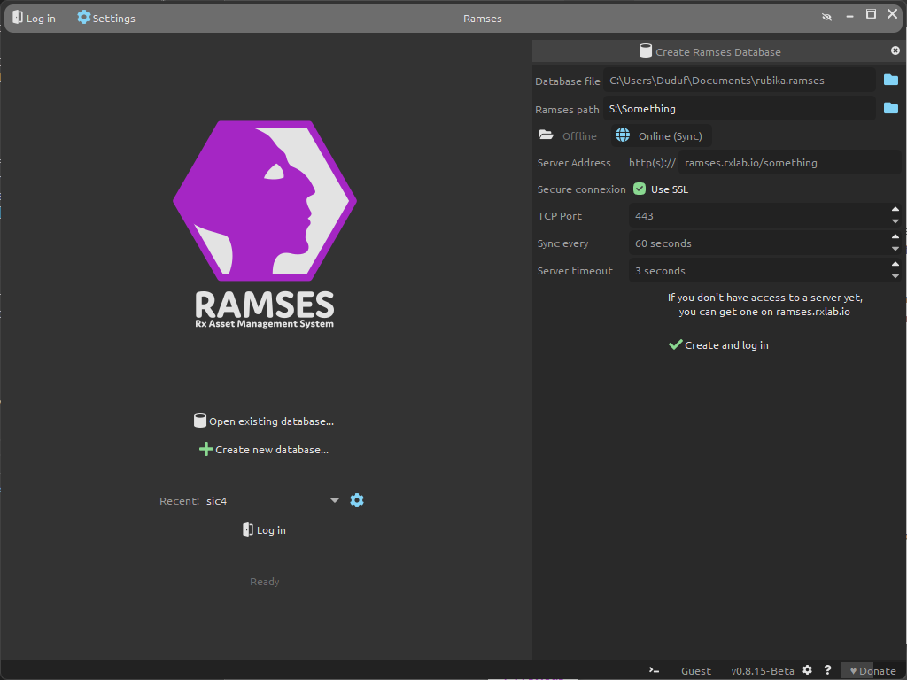
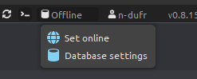

# Connection and Log in

## How it works

Ramses saves some meta-data about the production of your project, essentially to help you track the production and list all your tasks; it doesn't handle the actual data of the film (like the Maya files, texture files, etc.) but just help you store them at their correct location.

This meta-data Ramses needs to use is always saved *locally* on your computer; in order to work on the same data with the other students and share all the information, Ramses syncs this meta-data using a *Ramses Server* managed by [*RxLaboratory*](https://rxlaboratory.org).

The local data is a simple file you can save anywhere on your computer, with them `.ramses` file name extension. This file can also be sent to other people to be opened with Ramses if you need, that's another simple way to share this meta-data.

## First login

The first time you're using Ramses, you'll have to create this local database.

Just click on *Create new database...*

You'll be able to edit the database settings in a side panel.

These are the settings you'll have to use:

- **Database file**: this is the path where you'll save the local *.ramses* data. It can be anywhere on your computer; in your documents seems to be a good idea. Give it a simple but meaningful name, like *rubika.ramses*.
- **Ramses path**: this must be the folder where you'll be working on your project. It is a network drive where all students have access, which usually is on the `S:\` or `Z:\` drive (although that may change). The exact path has been given during your first class about Ramses. **Be careful, it is important to set the exact and correct path!**
- You have to click the **Online (Sync)** button to access the network settings and share the data with the Ramses Server.
- The server address depends on your location and class:  
    - Valenciennes, 5th year: `ramses.rxlab.io/sic5-2023-2024`
    - Valenciennes, 4th year: `ramses.rxlab.io/sic4-2023-2024`
    - Montreal, both classes: `ramses.rxlab.io/rubika-montreal`
- Don't change the other settings. *SSL* should be checked and the *TCP Port* should be *443*.

When the settings are correct, you can click on **Create and log in**.

If the server is available, Ramses will ask for your username and password. These have been given to you during the first class about Ramses.

## Connection issues

After you log in, Ramses will start syncing the local data with the server and the other students.

To improve this process and avoid sending too much data over the internet, the syncing is not continuous: Ramses syncs the data at regular intervals. It is normal if modifications take a few minutes to appear on the other instances.

When syncing the data, if there are network errors (because internet is temporarilly unavailable for example), Ramses will show an error and switch to the **offline mode**. You can continue using it in this mode without problem, but the data won't be synced until you switch back to the **online mode**, so it is advised to try to switch back to the online mode from time to time, as soon as internet is working again:
    
- Click the *offline* button at the bottom of the window (which shows the server adress when it is online), then choose *Set Online*. Ramses may ask for your credentials again.  
    
