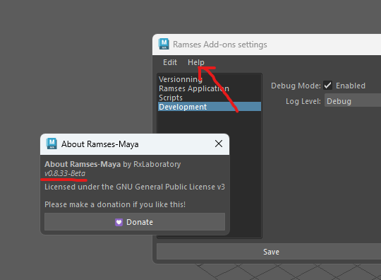
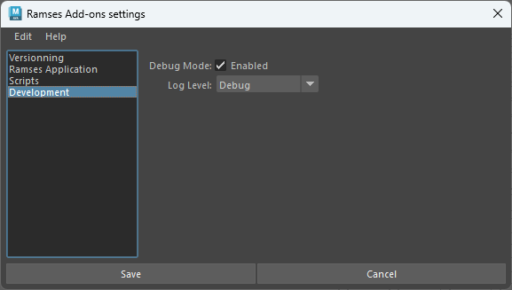

# Ramses for Maya

## Troubleshooting

If you have any issue when using the Ramses Maya Add-on, please follow these steps to help us diagnose the problem.

1. Make sure you're using the latest version of the add-on. Open the add-on settings, and in the `help` menu, click `Check for update`. With `About...` you can also check the version number.  
    
1. In the maya console: enable the `history / show stack trace` option. With this, there will be more info about script errors in the console.
2. In the settings of Ramses, in the `development` tab, enable the `debug mode` and set the log level to `debug`.  
    
3. Try again what's failing, and send us the content of the Maya console on discord!

