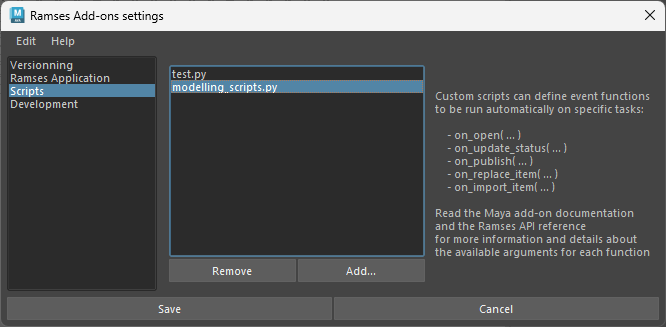

# {: style="width:48px;" } Extending the Ramses Maya Add-on

You can easily add features to the *Ramses Maya Add-On*, especially by registering your own scripts/methods to be run when a status changes, when a scene is being published, or to import items for example.

You can also easily use the included [*Ramses Scripting API*](../../dev/add-ons-reference/index.md) as a *Python module* to develop your own functions.

Technically, there are two ways to extend the maya module:

- Easy: Register your handler functions to be triggered on specific events
- Advanced: Fork the module to add your own methods or replace existing methods

## Register custom event handlers

The Ramses API exposes several events to which you can hook your own handler functions. This can easily be done by implementing these functions in a simple Python script and registering them with the settings of the Maya Add-on.

This way, the Add-on will automatically run your functions during these specific events, like when opening a file, publishing an asset, importing an asset, etc. The list of available events is documented in the [Ramses API Reference](../../dev/add-ons-reference/ramses.md#events-and-handlers)

For example, to run a function when a file is opened with Ramses, write this simple script in a Python file:

```py
# modelling_scripts.py

from maya import cmds # The Maya commands

def on_open( ram_item, file_path, ram_step ):
    """Ramses will hook this function to the on_open event"""
    
    if not ram_step:
        # it seems the step is unknown
        return

    # Check if this is the modelling step
    if ram_step.shortName() != "Mod":
        # Do nothing, this script is only for modelling!
        return

    if not ram_item:
        # The file being opened doesn't belong to a valid RamItem
        return

    # Show the name of the item being opened
    message = "Congrats, you are ready to model " + ram_item.name()
    cmds.inViewMessage(amg=message, pos='midCenterBot', fade=True)
```

To register this function, you just need to add the file in the script list in the settings of the Maya Add-on:



Because the function is named `on_open`, it is run each time an asset is opened by Ramses. The Python script can contain as many of these functions as there are events available. This list of available events is available in the [Ramses API Reference](../../dev/add-ons-reference/ramses.md#events-and-handlers), along with the details about the arguments which can be passed to these functions.

## Fork / Modify the module

### Install the Add-On

First, install the *Ramses Maya Add-On* as described [here](maya.md).

These folders should be available:

- ***icons***: The icons used by the Add-On
- ***plug-ins***: The actual *Python* code
    - ***dumaf***: Some useful *Python* code for *Maya*
    - ***ramses***: The [*Ramses Scripting API*](../../dev/add-ons-reference/index.md) as a *Python module*
    - ***ramses_maya***: The Add-On itself
- ***shelves***: The *Ramses Maya shelf*

### Create your module

All you need to do to easily extend the *Ramses Maya Add-On* is to create your own module in the `plug-ins` folder.

Create a subfolder in the `plug-ins` folder, containing an empty `__init__.py` file. You can also optionally add your own *shelf* in the `shelves` folder.

The new tree should look like this:

- *icons*
- *plug-ins*
    - *dumaf*
    - *ramses*
    - *ramses_maya*
    - ***your_new_module***: contains `__init__.py`
- *shelves*: optionally add `shelf_YourModule.mel`

In the new `your_new_module/__init__.py` file, you will import or code all the methods you want to expose and make available in Maya, for example to be used in a *shelf* or any other *Python* script. You can also register your *Ramses* callbacks there (read below for more information about *Ramses* callbacks).

Here is an example of such an `__init__.py` file, assuming you have two other files (*anotherFile.py* and *aSecondFile.py*) in the same folder, containing the actual code and methods to import:

```py
from .anotherFile import aPublicMethod
from .aSecondFile import aPublishMethod, anImportMethod

# Now, 'aPublicMethod' can be called from everyhwere in Maya

# And we can register the publish and import method as callbacks for Ramses.
# For this, we need to import the Ramses Module (API)
from ramses import Ramses
# Now we just have to add the callbacks:
ramses = Ramses.instance()
# The publish method
ramses.publishScripts.append( aPublishMethod )
# The import method
ramses.importScripts.append( anImportMethod )
```

### Import the module

Finally, you just have to import your new module in the `ramses_maya` module: add a simple import at the end of the `ramses_maya/__init__.py` file:

```py
import your_new_module
```

Both the new module and the shelf will be automatically registered by the *Ramses Maya Add-On* when it's loaded in *Maya*.

### Events and handlers

*Ramses* stores a list of handlers for each event you can extend, like [`Ramses.publishScripts`](../../dev/add-ons-reference/ramses.md) or [`Ramses.importScripts`](../../dev/add-ons-reference/ramses.md). The complete list of events and their corresponding handler lists are available in the [Ramses API Reference](../../dev/add-ons-reference/ramses.md#events-and-handlers).

Each handler function you add to these lists must take a few arguments. Read the [Scripting API Reference](../../dev/add-ons-reference/ramses.md#events-and-handlers) for more information.

Once the handlers have been added, they are automatically called when the user interacts with the add-on and wants to update/import/publish... an item.

Read the [Scripting API Reference](../../dev/add-ons-reference/ramses.md) for more information.

#### Adding your custom handlers

To register your handlers, you just have to append them in the corresponding `Ramses` lists:

```py
# We need to import the Ramses Module (API)
from ramses import Ramses
# Now we just have to add the callbacks
ramses = Ramses.instance()
# First, you may (or may not) remove callbacks provided by the Ramses addon,
# to replace them with your own
ramses.publishScripts = []
ramses.importScripts = []
ramses.statusScripts = []
# A publish method
ramses.publishScripts.append( aPublishMethod )
# An import method
ramses.importScripts.append( anImportMethod )
# A status method
ramses.statusScripts.append( aStatusMethod )
```

Now, all these methods will be automatically called each time a status changes, an item is published, or an item is imported.

### Detailed Example

In this example, three files are added, with the import, status, and publish methods.

The file `plug-ins/your_new_module/myPublishCallbacks.py` creates the handlers used to publish shots and assets.

```py
# myPublishCallbacks.py

import ramses as ram

# Get the ramses instance
ramses = ram.Ramses.instance()

def publishAsset(item, filePath, step):
    """Callback used to publish Assets only"""
    # The item must be a RamAsset
    if item.itemType() != ram.ItemType.ASSET:
        return
    
    # Now we can do what we need using the RamAsset object, the filePath and the Step
    doSomething( item.shortName(), item.group(), filePath, step.shortName())
    # etc.

def publishShot(item, filePath, step):
    """Callback used to publish Shots only"""
    # The item must be a RamShot
    if item.itemType() != ram.ItemType.SHOT:
        return
    
    # Now we can do what we need using the RamShot object, the filePath and the Step
    doSomething( item.shortName(), item.duration(), filePath, step.shortName())
    # etc.

```

The file `plug-ins/your_new_module/myStatusCallbacks.py` creates the handlers used when a status changes.

```py
# myStatusCallbacks.py

import ramses as ram

# Get the ramses instance
ramses = ram.Ramses.instance()

def updateAsset(item, status, step):
    """Callback used to update Assets only"""
    # The item must be a RamAsset
    if item.itemType() != ram.ItemType.ASSET:
        return
    
    # Now we can do what we need using the RamAsset object, the RamStatus object and the RamStep object
    doSomething( item.shortName(), item.group(), status.completionRatio, status.user, step.shortName())
    # etc.

def updateShot(item, filePath, publishFolderPath):
    """Callback used to update Shots only"""
    # The item must be a RamShot
    if item.itemType() != ram.ItemType.SHOT:
        return
    
    # Now we can do what we need using the RamAsset object, the RamStatus object and the RamStep object
    doSomething( item.shortName(), item.group(), status.completionRatio, status.user, step.shortName())
    # etc.

```

The file `plug-ins/your_new_module/myImportCallbacks.py` creates the handlers used to import items.

```py
# myImportCallbacks.py

import ramses as ram

# Get the ramses instance
ramses = ram.Ramses.instance()

def importAsset(item, filePath, step):
    """Callback used to import Assets only"""
    # The item must be a RamAsset
    if item.itemType() != ram.ItemType.ASSET:
        return
    
    # Now we can do what we need using the RamAsset object, the RamStep object and the file path
    doSomething( item.shortName(), item.group(), step.shortName(), filePath)
    # etc.

```

The file `plug-ins/your_new_module/otherMethods.py` creates a few other methods, for example to be used in a *Maya shelf*.

```py
# otherMethods.py

def methodForAShelf():
    doSomething()

```

Finally, we just need to import these files in the `plug-ins/your_new_module/__init__.py` file of our custom module. We can register them here.

```py
# __init__.py
from myImportCallbacks import importAsset
from myStatusCallbacks import updateAsset, updateShot
from myPublishCallbacks import publishAsset, publishShot
from otherMethods import methodForAShelf

from ramses import Ramses

# Get the ramses instance
ramses = Ramses.instance()

# First, remove callbacks provided by the Ramses addon,
# to replace them with our own
ramses.publishScripts = []
ramses.importScripts = []
ramses.statusScripts = []

# Add the callbacks to the publish list
ramses.publishScripts.append( publishAsset )
ramses.publishScripts.append( publishShot )

# Add the callbacks to the status list
ramses.statusScripts.append( updateAsset )
ramses.statusScripts.append( updateShot )

# Add the callbacks to the status list
ramses.importScripts.append( importAsset )
```

And don't forget to import your new module in `plug-ins/ramses_maya/__init__.py`:

```py
import your_new_module
```

Don't change anything else in the file!

Now you can also use `methodForAShelf()` in an existing or new *shelf*, which can be stored in the `shelves` folder if you want it to be deployed with your extension.


