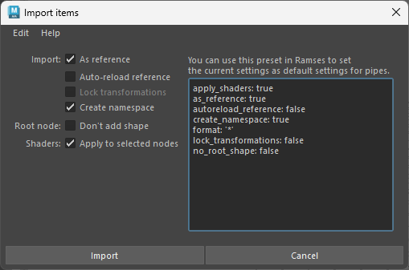

# Importing assets

When importing or replacing assets, there are a few options. The same way publish settings can use presets or be set directly in the *Ramses Client Application*, *Ramses* will look for presets and default settings when importing the assets.


In the first tab, you can optionally select an existing preset.

Presets are stored in a folder inside the Maya module folder. You can save or load a preset with `Edit ► Save preset...` and `Edit ► Load preset...`. When a preset is saved in the default folder, it is listed in the box in this tab.

*Ramses* provides a few presets by default, they're good examples of what you can do.

- `Alembic - Reference and shaders` imports an alembic file as a reference, along with *Maya* shader libraries.
- `Alembic and shaders` imports an alembic file, and *Maya* shader libraries as a reference.
- `Maya - Lock transform` imports a Maya file, and locks the transformations of the imported asset.
- `Maya - Reference` references a Maya file.
- `Maya` simply imports a Maya file.

You can safely delete these presets from the preset folder if you don't need them.

## Format settings

For each format to import, you can set some settings.



The text on the right can be copied to any [pipe type](../../components/client/pipetypes.md) in the *Ramses Client Application*. When importing an asset, *Ramses* will first look for these settings, and if they're found, it won't show the settings dialog unless the user checked the box `Edit import options` when importing the asset.

- Files can be imported as **references**.
- **All transformations** of all nodes can be *locked*.
- By default, a **namespace** is created to store the imported objects. This can be deactivated. Use with caution as name conflicts can generate errors on import/update!
- Imported objects are grouped in a transform node. By default, a **shape** (a square around the objects as a *nurbsCurve*) is created to easily manipulate them in the viewport.
- When importing a shader library, **shaders can automatically be applied** on the selected nodes.
  *Ramses* will use the node names to apply the shaders: the selected nodes must have the *exact same name* as the nodes in the scene used to publish the shaders.

## Shaders

When **importing a shader library**, as published with the publish method of the *Add-On*, ***Ramses* will automatically assign these shaders** to any mesh imported along with the shaders; this is a quick way to import both *Alembic* meshes and their shaders for example: just import both files at once.

If you just want to assign the shaders to existing geometry, just select on or several nodes containing the meshes, and *Ramses* will try to assign the imported shaders to them, using the names of the transform nodes containing the meshes. If the shaders are not correctly assigned, check the names of the nodes. Namespaces are ignored when matching nodes with their shader.

If you need to replace or reassign shaders already imported, the quick and easy way is to remove them from the scene, select the meshes, and import them again. All the shaders will be automatically re-assigned.

## All Settings

These are all the available settings:

```yaml
format: '*' # The file format these settings apply to. Either a wildcard '*' or the file extension (without the leading ".")
apply_shaders: true
as_reference: false
lock_transformations: true
create_namespace: true
no_root_shape: false
```

These settings can be set directly in the [Ramses Application's pipeline editor](../client/pipeline.md), or directly using the [pipe editor](../client/pipetypes.md), in the settings field.