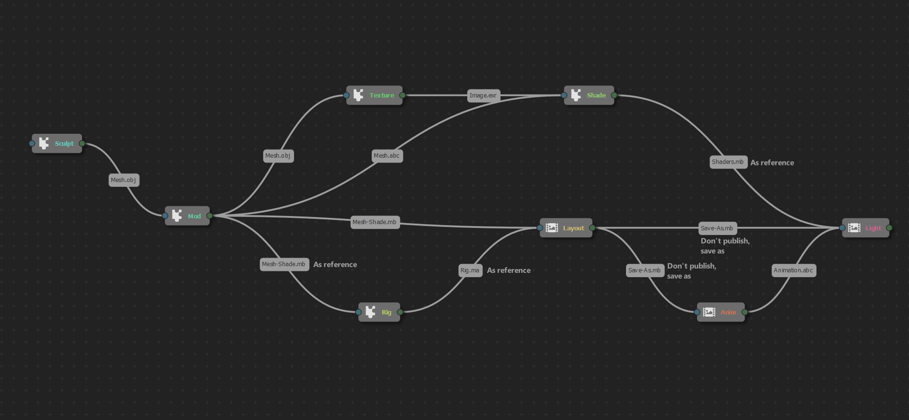

# The Maya pipeline

With Ramses and its Maya Add-on, the Maya pipeline is easy-to-use but you have access to all parameters when publishing and importing files. Using presets and/or the *Ramses Client Application* you can completely automate the pipeline according to your specific needs.

**▹ Read more about the [pipeline](../../pipeline/pipeline.md).**

The Maya Add-on can export (publish), import and update the assets across all your Maya projects, using different file formats (*maya*, *alembic*, etc.); but note that sometimes it's easier and quicker to just save a project from a step as a new project for the next step, instead of publishing and importing almost everything.

## A typical Maya prodution pipeline

This is a typical Maya production pipeline, using *Ramses* (or not).  
Sculpting and texturing steps are not covered here as they're not done using Maya.

{target="_blank"}

| Step | Import | Publish | Notes |
| --- | --- | --- | --- |
| **Modeling** | `.obj`, `.fbx`, etc. from a sculpting application like ZBrush | • `.obj`, `.fbx`, `.abc`... for a texturing application. • `.mb`, `.ma` or `.abc` for the rigging and the shading step. • `.mb` with just the shaders if the mesh is published as an alembic for the rigging step. | Basic shaders may be useful for the next steps (like the pupil in the eye), but alembic files don't contain shaders. Shaders need to be published in a sidecar Maya file, *if and only if* the mesh is published as an alembic file (which may be lighter and an easy way keep the data clean). |
| **Rigging** | • `.mb`, `.ma` or `.abc` from the modeling step, optionally as a *reference*. • `.mb` with just the shaders if the mesh was published as an alembic from the modelling step, optionally as a *reference*. | • `.ma` for the layout step. | If the mesh is imported as a reference, it's easier to update as there's no need to transfer the skinning data. In order to avoid nested dependencies, the reference then needs to be imported before the rig is published; *Ramses* does it by default. |
| **Shading** | • `.mb`, `.ma` or `.abc` from the modeling step. • `.mb` with just the shaders if the mesh was published as an alembic from the modelling step. | • `.mb` with just the shaders. | When shaders are published with *Ramses*, their association to the geometry is stored using the node names, in order to re-apply the shaders to the corresponding nodes at the lighting step. The name of the nodes containing the meshes must not change after the modeling step. |
| **Layout** | • `.mb`, `.ma` or `.abc` of the assets from the modeling step. • `.mb` with just the shaders if the mesh was published as an alembic from the modelling step. • `.ma` from the rigging step as a *reference*. |  | Nothing to publish, the project can be saved as a new animation project, and a new lighting project, which will contain everything and keep the reference to the rigged characters and props for an easy update of the rigs. |
| **Animation** | Open the layout project and save it as the animation project. Import the rigged characters if they're not in the layout project: • `.ma` from the rigging step as a *reference*. | • `.abc` for the lighting step. Export all animated meshes and the camera. | Exporting the animated objects as Alembic files helps make the lighting project lighter, by removing all rigs. |
| **Lighting** | Open the layout project *or* the animation project, and save it as the lighting project. Remove all rigs. Import the shaders, the animated meshes, and the camera: • `.mb` from the shading step as a *reference*. • `.abc` from the animation step. | • `.exr` to be used in the compositing application. | The lighting project is the same as the layout project, where all rigs are replaced by their corresponding Alembic animation, and shaders are imported on all these meshes. |

There may also be a *Set Dressing* step, where small assets are assembled and grouped in a bigger scene. This group of assets can then be imported in the layout project. In this case, from the layout project, either the whole group or single assets can be updated when needed. But the group of assets from the *Set Dressing* step must not contain any rigged prop or character, as that would lead to nested references and should be avoided in any case.

## Configure the pipeline

**▹ Configure the [pipeline in the *Ramses Client Application*](../../pipeline/pipeline.md).**

- [Scene setup](maya-scenesetup.md)
- [Publish settings](maya-publish.md)
- [Import settings](maya-import.md)