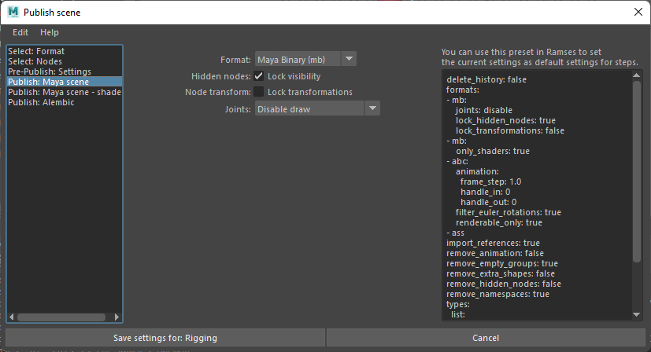
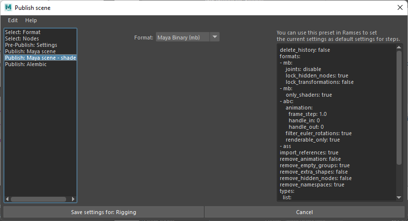
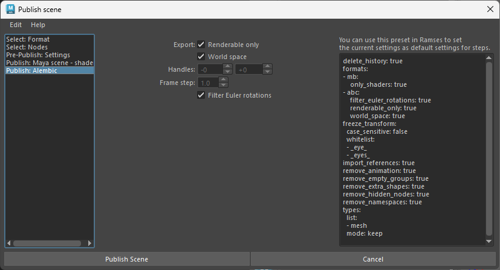

# Setting the publishing parameters

Use the { style="width:28px"} ***Publish settings*** button from the *Add-on*'s shelf to access all available parameters for publishing in Maya. From this dialog, you can build your own presets, or set some settings as defaults for any specific [step](../../pipeline/pipeline.md) in your [pipeline](../../pipeline/pipeline.md).

  

In the first tab, select the step for which your setting the publishing parameters, and optionally select an existing preset.

Presets are stored in a folder inside the Maya module folder. You can save or load a preset with `Edit ► Save preset...` and `Edit ► Load preset...`. When a preset is saved in the default folder, it is listed in the box in this tab.

*Ramses* provides a few presets by default, they're good examples of what you can do.

- `Animation.abc` can be used for publishing animation and cameras as a lightweight alembic file.
- `Arnold.ass` is a simple preset to publish the selected nodes as an *Arnold Scene Source*.
- `Geometry.abc` is meant for publishing mesh nodes without animation. Shaders are automatically published separately as a *Maya Binary*.
- `Rig.ma` can be used to publish rigged characters and props, and more generally any kind of Maya scene, as a *Maya ASCII* file.
- `Shaders.mb` publishes only the shaders from the selected nodes.
- `Simple.mb` is a general preset which can be used with any kind of scene.

You can safely delete these presets from the preset folder if you don't need them.

The text area on the right shows the preset as a text. This text can be saved or used directly in the publish settings of any step in the *Ramses Client Application*, to be automatically used when publishing files for the given step. In this case, this settings window will not be shown anymore when publishing files, unless the user checks the *Edit publish settings* box when saving the scene.

If the *Ramses Client Application* is running, you don't necessarily need to use presets; clicking on the `Save settings` button will set the current settings to the selected step. They can then also be [edited directly in the *Ramses Client Application*](../../components/client/steps.md).

This text uses the [*Yaml*](https://yaml.org/) syntax, which can easily be edited manually.

## Pre-Publish settings

Before publishing, *Ramses* can run some checks and clean the scene.


- **Import all references**, to avoid nested references
- **Remove namespaces**, to simplify node names when importing
- **Remove all hidden nodes**
- **Delete all histories**
- Leave only **a single shape per transform node**. Extra shapes should not be needed.
- **Remove all empty groups**
- **Remove all keyframes** and animation
- **Types**: you can choose to keep (white list) or remove (black list) specific node types.  
  To check the types of the nodes to complete the list, use the Mel/Python command `nodeType`.
- **Freeze transformations of all the nodes**, except those containing specific strings in their name.

## Maya scene



- Select either ***Binary*** or ***ASCII file***.
- **All hidden node visibilities** can be automatically **locked**.
- **All transformations can be locked**.
- You can select **how joints will be displayed** in the published file.

## Maya scene - Shader library



- Select either ***Binary*** or ***ASCII file***.

When publishing a shader library, *Ramses* keeps the list of nodes the shaders are applied to, and is able to re-assign them when importing the library in any scene.

## Alembic



- You can choose to **keep only renderable nodes** and remove all other shapes.
- Use the **handles** control to add some time before and after the scene's time range.
- You can change the **frame step** to make the exported file lighter or more detailed (e.g. for precise motion blur).
- You can automatically **filter Euler rotations**.

## Arnold Scene Source

There are no options for this format.

## All Settings

These are all the available settings:

```yaml
delete_history: false
formats: # Format specific options
- mb: # Maya Binary options
    joints: disable # one of "disable", "hide", "lock", "keep"
    lock_hidden_nodes: true
    lock_transformations: false
    only_shaders: true
- abc:  # Alembic options
    animation:
      frame_step: 1.0
      handle_in: 0 # in frames
      handle_out: 0
    filter_euler_rotations: true
    renderable_only: true
- ass # Arnold secne source options (emtpy, no options)
freeze_transform: 
  case_sensitive: false
  whitelist:
  - _eye_
  - _eyes_
import_references: true
remove_animation: false
remove_empty_groups: true
remove_extra_shapes: false
remove_hidden_nodes: false
remove_namespaces: true
types:
  list:
  - bezierCurve
  - nurbsCurve
  - nurbsSurface
  - locator
  mode: remove # either "remove" or "keep"
```

These settings can be set directly in the [Ramses Application's step editor](../client/steps.md), in the *Publish* settings tab.