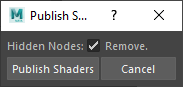
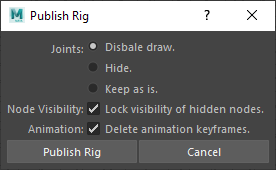
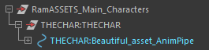
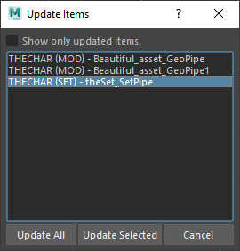

# {: style="width:48px;" } Rubika Flavor of the Ramses Maya Add-on

The *Rubika Flavor* of the *[Ramses Maya Add-on](maya.md)* is an extension of the add-on developed to be used at the *[Rubika Supinfocom](http://rubika-edu.com)* school, automating the workflow and production pipeline of the graduation movie of the students during the last year of their studies.

It is provided as an example extension of the *[Ramses Maya Add-on](maya.md)* and can be used as-is in other productions too.

It extends the default add-on with some automations when exporting and importing items, and adds an *Update* command, located in the *Ramses* shelf too.

<figure>
  
  <figcaption>The shelf is almost the same as the default add-on, except for the extra <i>Update</i> button.</figcaption>
</figure>

The *Rubika Flavor* of the [*Maya Add-on*](maya.md) automates the publication, import and update of the items according to how the pipeline is set up in the *Ramses Client Application*. When publishing or importing an item, the *Add-on* asks the *Ramses Daemon* which formats needs to be published or imported and then runs the corresponding automation scripts.

This makes the add-on very versatile, as it adapts to the way the pipeline has been designed, using a simple set of predefined formats to be used through the pipes. Read the [*Configuration and settings*](#configuration-and-settings) section to learn how to configure the pipeline.

As well as the default add-on, the *Rubika Flavor* can also be used without the *Ramses Client Application*, in which case it will fall back to predefined default values and formats explained in the [*Configuration and settings*](#configuration-and-settings) section below.

## Publication

Before publishing an item from an asset or a shot scene, you have to tell *Ramses* exactly what you want to publish. *Ramses* **doesn't publish all the content of the scene**, but only what has been set to be exported.

To set the items to be exported, you just have to include them in one of the following predefined *Maya Sets*.

| Set name | Desciption |
| --- | --- |
| `Ramses_Publish` | The items to be published |
| `Ramses_Proxies` | The proxies to be published (either geometry, or shaders). For shaders, add the geometry associated to the shaders to be exported. |
| `Ramses_DelOnPublish` | This special set contains the nodes to be removed from the scene before publishing it. |

The easiest way to always have these sets available in the scenes is to create them in the template files used by each step.

!!! warning
    The names of the sets are case sensitive! `Ramses_Publish` will be handled, but not `ramses_publish`.

You just need to add the root node of the items to publish in the corresponding set; Do not add the whole hierearchy! *Ramses* will automatically publish all its children. This root node can be of any type, and not necessarily a group.

In this example, "*Beautiful_asset*" and "*Another_item*" will be published in separate files: *Ramses* publishes altogether all the child nodes of the nodes found into the `Ramses_Publish` set.

All exported files contains the name of the pipe and the name of the item if any, as defined in the pipeline editor of the *Ramses Client Application*.

<figure>
  
  <figcaption>This is how the published files are listed in the Add-on (with the *Open and Import* command).</figcaption>
</figure>

<figure>
  
  <figcaption>This is how the published files are listed in the <i>Ramses Client Application</i>.</figcaption>
</figure>

*Ramses* will also copy an extra file in the `_publish` folder: a copy of the Scene as it is at the moment you publish it.

According to the information the add-on gets from the *Daemon*, when publishing items from specific steps, a few options may be shown.

## Configuration and settings

The *Add-on* automatically publishes and imports items using predefined formats and configurations. These formats can be set to be used between any step in the production pipeline, configured using the *Ramses Client Application* pipeline editor.

<figure>
  
  <figcaption>An example of a simple pipe as shown in the <i>Ramses Client Application</i> pipeline editor.</figcaption>
</figure>

As you can see in this example, each step can be connected using several formats.

The *Add-on* gets the predefined name of the pipes to export the items in the corresponding formats.

### Pipe formats

Here is the list of all the pipes the *Add-on* can handle.

| Pipe ID | Supported file formats | Description |
| --- | --- | --- |
| `Anim` | Alembic (.abc) Maya ASCII (.ma) Maya Binary (.mb) | Character and VFX animation. |
| `Geo` | Alembic (.abc) Maya ASCII (.ma) Maya Binary (.mb) | Used to export meshes. |
| `pGeo` | Alembic (.abc) Maya ASCII (.ma) Maya Binary (.mb) | The proxy geometry to be replaced on rendering by an Arnold Scene Source or any other higher definition geometry. |
| `pSha` | Arnold Scene Source (.ass) | The Arnold scene to be used when rendering to replace proxy geometries by the high definition version. |
| `rdrSha` | Maya Binary (.mb) | Render shaders, the final version of the shaders. |
| `Rig` | Maya ASCII (.ma) Maya Binary (.mb) | Rigged characters and props. |
| `Set` | Maya ASCII (.ma) Maya Binary (.mb) | Sets made of other assets. |
| `Std` | Alembic (.abc) Maya ASCII (.ma) Maya Binary (.mb) | A Standard Maya file with minimal changes before publishing. |
| `vpSha` | Maya Binary (.mb) | Viewport shaders, a lightweight version of the shaders used for draft display in the viewport. |

!!! warning
    The pipe IDs are case sensitive! `Geo` will be handled, but not `geo`.

These pipes are described in more details in the sections below.

<figure>
  
  <figcaption>An empty pipe.</figcaption>
</figure>

<figure>
  
  <figcaption>An unsupported pipe.</figcaption>
</figure>

When a pipe is not configured or uses unsupported formats, or if the *Ramses Daemon* is not available (because the add-on is not used with the *Ramses Client Application*), *Ramses* will fall back on the Step names to try to export something anyway, using the following rules.

| Step ID | Default output pipe IDs | Description |
| --- | --- | --- |
| `MOD` (Modeling) | `Geo` `pGeo` `vpSha` | Geometry Proxy Geometry Viewport Shaders |
| `SHADE` (Shading) | `rdrSha` `pSha` `pGeo` | Render Shaders Arnold Scene Proxy Geometry |
| `RIG` (Rigging) | `Rig` | Rigging |
| `SET` (Sets) | `Set` | Sets of assets |
| `LAY` (Layout) | `Std` | A Standard file. |
| `LIGHT` (Lighting) | `Std` | A Standard file. |
| `ANIM` (Animation) | `Anim` | Baked animation. |
| `VFX` (Visual Effects)) | `Anim` | Baked animation. |

These default values are defined in the `plug-ins/rubika/utils_constants.py` source file of the add-on.

### Animation - `Anim`

Ramses will clean the scene before exporting, removing everything not checked in the options and not included in the Ramses_Publish Maya set.

{ style="width:300px" }

A root controller is added as a parent of the root node of the published animation (a simple curve), which stores needed meta-data and can be used to manipulate the item once imported into another scene.

### (Proxy) Geometry - `Geo` and `pGeo`

*Ramses* will clean the scene before exporting, removing everything checked in the options and not included in the `Ramses_Publish` *Maya* set. It also removes all histories from the exported nodes. And it finally freezes the transformations of all objects by default, except for the ones which names contain the strings defined in the "*Don't freeze tranformations for*" field.

By default it will also remove all curves and surfaces to publish only meshes, but you can change that in the options if needed. If a curve or a surface is part of the hierarchy (it has child meshes), only the *shape* node will be removed, but the *transform* node is kept (effectively transforming the node into a simple *group*): this way everything stays as it is without any modification.

{ style="width:300px" }

A root controller is added as a parent of the root node of the published geometry (a simple curve), which stores needed meta-data and can be used to manipulate the item once imported into another scene.

### Proxy shaders  - `pSha`

*Ramses* exports the items as an *Arnold Scene Source* (.ass) file. This pipe is usually used in conjunction with a *Proxy Geometry* pipe (*pGeoPipe*) which will export the geometry used as a proxy for the *Arnold scene*.

### Render and Viewport shaders  - `rdrSha` and `vpSha`

Everything except shaders is removed from the scene; the only option is to also remove shaders associated with hidden nodes.

*Ramses* then saves a *Maya* scene containing only these shaders, and stores associated meta-data to be able to assign these shaders back to the corresponding geometry (see the [*Import*](#import) section for more details).

### Rig - `Rig`

As with other pipes, a few options are available to select what to remove to clean the scene, as well as choosing the default display for the joints.

The rig is published in a simple *Maya* Scene, where everything else has been removed.

### Set - `Set`

Sets are published as a simple *Maya* Scene where everything else has been removed; all meta-data and links with external assets are kept, so that individual assets can be updated later, as well as the whole set, but individual root controllers of included assets are hidden.

The options are the same as with Geometry.

### Standard - `Std`

Standard publication is the default format, where everything not included with the items to be published is simply removed, and the Scene is then published as is, as a simple *Maya* Scene.

## Import

When items are imported in a Scene, *Ramses* sorts them in groups at the root of the Scene, depending on their type, group, and where they're from. Root controllers are colored to make them easily recognizable. The name of the pipe where they came from is kept for future information.

It is possible to select several input pipes at once, for example to import both the geometry and the shaders at once; *Ramses* will automatically handle the import and assign the right shaders to the right geometry in this example.

### Animation - `Anim`

When importing an animation, *Ramses* can try to remove corresponding existing rigs from the scene before, so that only the baked animation is kept.

### (Proxy) Geometry - `Geo` and `pGeo`

Geometry is simply added to the scene, sorted in its corresponding group.

### Proxy shaders  - `pSha`

There is no automatic import of *Arnold Scene Sources*. You have to manually handle them.

### Render and Viewport shaders  - `rdrSha` and `vpSha`

Shaders are imported to the current Scene, and *Ramses* will automatically assign them to any corresponding **selected** geometry before the import.

Shaders are imported as reference, so there's no need to update them once imported in a scene; except for switching between viewport shaders and render shaders.

### Rig - `Rig`

Rigs are imported as reference into the current Scene. You can safely import several times the same Rig, as *Ramses* will correctly handle namespaces so they're self-contained.

### Set - `Set`

Sets are imported the same way as geometry; the root controllers of the included assets are hidden, but they're still available and colored in the outliner.

If you need to modify a set in a specific shot, you'll want the modified assets to not be updated when the set is updated. To prevent that, just move the corresponding assets outside the hierarchy of the set, or update the assets individually.

## { style="width:32px"} Update

When updating, by default *Ramses* will list only the items which needs to be updated; if for some reason you need to re-import/update another item, uncheck the box at the top of the window.

!!! warning
    When updating an item, all the children of its root controller will be removed and replaced by the updated item.

    If you added an object to the hierarchy you want to keep, make sure to move it out before updating and parent it again after the update.
