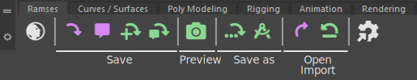
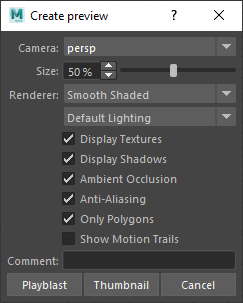
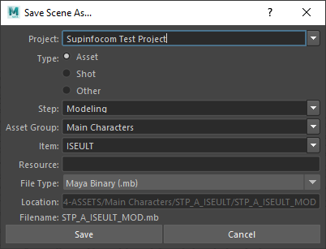
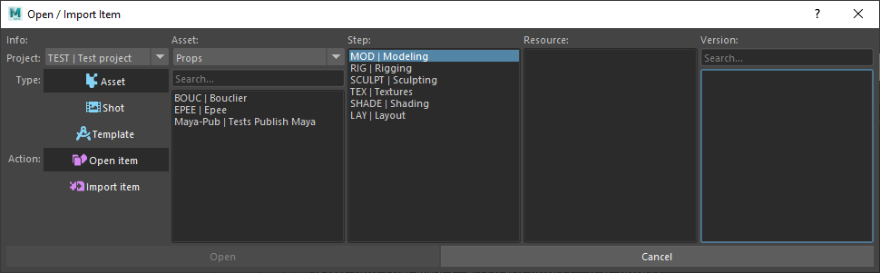
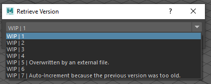
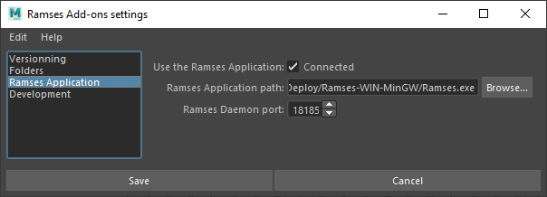
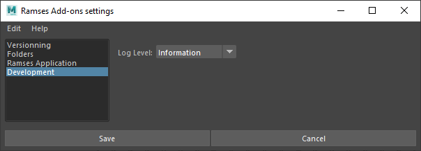

# {: style="width:48px;" } Ramses Maya Add-on

*Ramses* comes with an official add-on for ***Autodesk Maya***, which actually consists in a *Python* plug-in and a custom shelf packaged in a simple single module.

It is an example of an implementation of an add-on using the [*Ramses Python API*](../../dev/add-ons-reference) but it is already well suited for use in production.

As well as all other [*Ramses Add-ons*](index.md), the *Ramses Maya Add-on* includes the main features like versionning, publishing and production tracking with *Ramses*, but [it can be extended to automate your workflow](maya-extend.md). An example of such an extension is provided as the [*Ramses Maya Add-on __Rubika Flavor__*](maya-rubika.md).

This Add-on can be used with or without being connected to the *Ramses Daemon* (and the *Ramses Client Application*). If it is connected to the *Daemon*, it will automatically update the production tracking data.

## Installation

- [Download](https://github.com/Rainbox-dev/Ramses-Maya/archive/refs/heads/main.zip) and unzip the module.  
    To quickly deploy the module on several workstations, choose a shared location; the module can then be shared with all workstations and updated at once.
- Edit `Ramses.mod` with a text editor, and replace the path in the first line with the absolute path where you've unzipped the module.

This is how the content of this file looks like:

```
+ Ramses 0.0.1-dev D:\your\path\to\the\module
PYTHONPATH+:=plug-ins
MAYA_SHELF_PATH+:=shelves
```

Do not change anything else in the file.

- In order to prevent unintended modifications to the *Ramses* shelf, you can set its *read-only* attribute:
    - Right click on the `shelves/shelf_Ramses.mel` file and select `Properties`.
    - Check the `Read only` box.
- Copy `Ramses.mod` in one of your modules paths  
    e.g. `C:\Users\User\Documents\Maya\modules`.  
    You may need to create the *modules* folder if it does not exist yet.  
    Repeat this operation on all workstations where you need the module.
- Restart *Maya*.
- Activate the *Ramses* plug-in from *Maya*'s plug-in manager.


- You may need to restart *Maya* again so that the *Ramses* shelf is loaded.

## Features

All features of the *Ramses add-on* are available through the new shelf. They are also registered as *Mel* and *Python* *Maya* commands. All these features are detailed in the next sections.

To handle all file naming and sorting, *Ramses* includes commands to replace all the default *Save*, *Save As* and *Open* functions. Using (almost) only the *Ramses* commands ensures your files will always be correctly named and in the right location. It also helps *Ramses* track the production.



| Feature | *Maya* Command | Description |
| --- | --- | --- |
|  { style="width:28px"} **Open the _Ramses_ App** | `ramOpenRamses` | Launches the *Ramses Client Application* (if its path is correctly set in the settings).
|  { style="width:28px"} [**Save**](#save) | `ramSave` | Saves and backups the current scene; this save command is also used for production tracking. |
|  { style="width:28px"} [**Comment**](#comment) | `ramSave` | Associates a comment wit the current version file. |
|  { style="width:28px"} [**Incremental Save**](#incremental-save) | `ramSaveVersion` | Saves and increments the version of the current scene. |
|  { style="width:28px"} [**Update Status**](update-status-and-publish) | `ramSaveVersion` | Saves and increments the version of the current scene, while updating its current production tracking status. |
|  { style="width:28px"} [**Create Preview**](#preview) | `ramPreview` | Creates a preview (thumbnail or playblast) of the current scene. |
|  { style="width:28px"} [**Save as**](#save-as) | `ramSaveAs` | Saves the scene as a new Asset, Shot or General item. |
|  { style="width:28px"} [**Template**](#template) | `ramPublishTemplate` | Saves the current scene as a new template for the current scene. |
|  { style="width:28px"} [**Open**](#open-and-import) | `ramOpen` | Opens an Asset, Shot or Template. |
|  { style="width:28px"} [**Import**](#open-and-import) | `ramOpen` | Imports an Asset, Shot or Template. |
|  { style="width:28px"} [**Replace**](#open-and-import) | `ramOpen` | Replaces selected nodes with another Asset, Shot or Template. |
|  { style="width:28px"} [**Retrieve Version**](#retrieve-version) | `ramRetrieveVersion` | Retrieves and restores a previous version of the current scene. |
|  { style="width:28px"} [**Settings**](#settings) | `ramSettings` | Opens the settings dialog for the *Ramses Add-on*. |

## { style="width:32px"} Save

The *Ramses* *Save* command starts by saving the current scene, and then runs a few checks before backuping the file into the `_versions` subfolder:

- *Naming Scheme*: checks if the file is correctly named and located. If not, *Ramses* will run the *Save as* command instead to ensure the name is correct.
- *Version*: checks if the version has to be incremented. That's the case if the current scene is a restored previous version, or if the latest increment occured before the timeout set in the settings.

Depending on these checks, *Ramses* will automatically associate a comment with the corresponding version to warn of any changes.

The *Mel* and *Python* corresponding command is: `ramSave`. It can take two parameters:

- `-set_comment` or `-sc`: *boolean* used to set a comment associated to the current version file.
- `-comment` or `-c`: *string* is the comment to be associated if `-sc` is `True`.

```py
# Python
import maya.cmds as cmds

# Save the current file
cmds.ramSave()

# Save the file with a comment (show the comment dialog)
cmds.ramSave(set_comment = True)

# Save the file with a custom comment
cmds.ramSave(sc = True, comment = "A new comment!")
```

## { style="width:32px"} Comment

The *Comment* command saves the current scene the same way as the *Save* command, and adds a comment associated with the current version.

This comment is displayed with the corresponding version in all version selection dialogs, both in the add-on itself and in the *Ramses Client Application*, as shown below.

<figure>
  
  <figcaption>A list of versions with a few comments, as shown in the <i>Ramses Maya Add-on</i>.</figcaption>
</figure>

<figure>
  
  <figcaption>A list of versions with a few comments, as shown in the <i>Ramses Client Application</i>.</figcaption>
</figure>

The *Mel* and *Python* corresponding command is: `ramSave` with its two parameters `-sc` and `c`. Read the [*Save*](#save) section for details.

```py
# Python
import maya.cmds as cmds
# Save the file with a custom comment
cmds.ramSave(sc = True, comment = "A new comment!")
```

## { style="width:32px"} Incremental Save

The *Incremental Save* runs the save command and forces it to increment to a new version.

The *Mel* and *Python* corresponding command is: `ramSaveVersion` with the parameter `updateStatus` set to `False`. Read the [*Update Status*](#update-status-and-publish) section for details.

```py
# Python
import maya.cmds as cmds
# Incremental save
cmds.ramSaveVersion( updateStatus=False )
```

## { style="width:32px"} Update Status and Publish

The *Update Status* runs the *Incremental Save* command and updates the current production status of the current Asset or Shot.

A dialog is shown with a few options ot update the status, and to choose to also publish the scene, and create a preview for it. This dialog may differ depending on the use of the *Ramses Client Application* or not.

<figure>
  
  <figcaption>This is the status dialog when connected to the <i>Ramses Client Application</i>.</figcaption>
</figure>

- You can set the new ***State*** with the drop down list at the top right; the list of the states is retrieved from the *Ramses Daemon*.
- The slider and percentage is used to set a new ***Completion Ratio***.
- The ***Comment*** field is used to update the comment displayed in the production tracking tools and tables of *Ramses*.

All this information is automatically fed to the *Ramses Daemon* which updates the information for everyone.

<figure>
  
  <figcaption>This is the status dialog when the <i>Ramses Client Application</i> isn't available.</figcaption>
</figure>

- When not connected to the *Daemon*, there is still an option to set a ***State*** from a default limited list.
- Check the ***Publication*** button to publish the current scene.
- Check the ***Preview*** button to create a preview (thumbnail or playblast) for the current scene. Read the [*Preview*](#preview) section for more details.

The ***Update Status and Save*** button updates the status, publishes the scene, and creates the preview, while the ***Skip and Just Save*** button just increments the version and saves.

The *Mel* and *Python* corresponding command is: `ramSaveVersion`. It can take three parameters:

- `-updateStatus` or `-us`: *boolean*. When `True` (default), the status dialog is shown to let the user update the status.
- `-publish` or `-p`: *boolean* activates the publication of the scene.
- `-preview` or `-pv`: *boolean* activates the creation of a preview.

```py
# Python
import maya.cmds as cmds

# Shows the update status dialog
cmds.ramSaveVersion()

# Incremental save
cmds.ramSaveVersion(updateStatus = False)

# Publishes the file without showing the status dialog
cmds.ramSaveVersion(publish = True, us = False)
# Publishes and creates a preview without showing the status dialog
cmds.ramSaveVersion(publish = True, preview = True, us = False)
```

### Publication

The publication of the scene is done in two steps:

1. The Scene is saved in the `_published` subfolder. This is the folder from which the scene can be imported or referenced into other Assets and Shots.
2. *Ramses* then calls any potential publish function registered by the pipeline tools or an extension of the Add-On, like the [*Rubika Flavor*](maya-rubika.md).

## { style="width:32px"} Preview

The *Preview* command allows you to quickly create either an image (thumbnail) or a video (playblast) preview of the current scene, automatically saved in the `_preview` subfolder.

There are a few options to adjust how the image or video are rendered.



- *Ramses* ***auto-selects the first renderable camera*** in the scene. To always automatically use the right camera, either add it in the render settings (and remove any other unneeded camera), or check the *renderable* option in the *Ouput Settings* section of its attributes.
- The ***size*** is a percentage of the resolution of the render settings of the scene.
- You can then adjust all the render options; checking both ***Only Polygons*** and ***Show Motion Trails*** allows to hide all animation controllers (if they're curves as usual) but keep the motion trails.
- By default, *Ramses* overwrites any previous image or video for the current scene, except if you set ***a new comment*** when making the preview. Note that the *Ramses Client Application* uses the preview with an empty comment as a thumbnail to display the asset or the shot in the user interface.

Ramses also automatically burns useful meta-data in the image, like the frame number, the focal length, the comment, etc.


The *Mel* and *Python* corresponding command is: `ramPreview`.

```py
# Python
import maya.cmds as cmds

# Shows the preview dialog
cmds.ramPreview()
```

### Playblasts

When rendering the playblasts, *Ramses* does not only renders them as usual *Maya* playblasts: you don't need to install *Quicktime* on windows anymore to export videos. *Ramses* automatically renders the playblasts in a very lightweight *MP4* video, crafted especially for reviewing animations, with an intra-frame encoding setting which enables frame by frame playblack on every video player, with great performance.

*Ramses* will also automatically play the video as soon as it's encoded using *ffplay*, a very efficient and lightweight video player. It may seem complicated at first as it does not have any User Interface, but it is easily controlled with a few shortcuts:

- To scroll in the video, `[Right Click]` anywhere on the video and drag the mouse horizontally. The left border of the frame represents the beginning of the video, while the right border represents the end.
- You can go forwards and backwards with the `[←]` and `[→]` keys of your keyboard by a few frames.
- Use `[↑]` and `[↓]` to go to the start or the end of the video.
- Use `[Space]` to play and pause the video.
- Use `[S]` for frame-by-frame playing.
- Hit `[Q]` to quickly quit the player.

## { style="width:32px"} Save As

The *Save As* command can be used to create a new Asset or Shot, or save any other new file, while automatically naming and locating it.



- *Ramses* automatically selects the current ***Project***.
- Select the type of item to save; either an ***Asset***, a ***Shot*** or another general item.
- The list of ***Steps***, ***Asset Groups*** and ***Items*** is automatically built either by asking the *Ramses Daemon* if the add-on is used with the *Ramses Client Application* or by looking into the folder structure, but it is possible to create a new one by just entering a new name.
- The ***Resource*** is used to differenciate several files for the same Asset or Shot. An empty *Resource* is considered the main and default working file for the item, but you can add any other file by just adding a small resource name.

When selecting *Other* as type, the file will be saved in the main folder of the corresponding step. Read the section about the [*Ramses Tree*](../files/index.md) for more information.

The *Mel* and *Python* corresponding command is: `ramSaveAs`.

```py
# Python
import maya.cmds as cmds

# Shows the save as dialog
cmds.ramSaveAs()
```

## { style="width:32px"} Template

Use the *Template* command to create a new template file to be used with a specific step.


Use the ***Name*** to have several templates for the same step.

!!! hint
    This command just creates the new template, but does not publish it. You still have to publish it using the [*Update Status*](#update-status-and-publish) command afterwards.

<figure>
  
  <figcaption>Templates can then be used to create new scenes for specific Shots or Assets from the <i>Ramses Client Application</i>.</figcaption>
</figure>

<figure>
  
  <figcaption>Templates are also available with the <i>Open / Import</i> command of the add-on.</figcaption>
</figure>

The *Mel* and *Python* corresponding command is: `ramPublishTemplate`.

```py
# Python
import maya.cmds as cmds

# Shows the publish template dialog
cmds.ramPublishTemplate()
```

## { style="width:32px"} Open, { style="width:32px"} Import, { style="width:32px"} Replace

The *Open and Import* command automatically finds available scenes from your projects.



It is not needed to go down all the hierarchy to select a file to open; if you just select an item and a step, *Ramses* will automatically open or import the corresponding latest version of the main resource. It works the same way when importing items: you don't need to go all the way down to select the files you want to import; by selecting just the main file, *Ramses* will import everything available, or, if you're using an [extension](maya-extend.md) of the *Add-on* such as the [*Rubika Flavor*](maya-rubika.md), it will pass all the files to the extension so it can automatically manage the import for you.

When importing an item, *Ramses* will also trigger custom import scripts registered by the pipeline tools or an extension of the *Maya Add-on*, such as the [*Rubika Flavor*](maya-rubika.md). This is one way of automating your workflow, by just registering scripts to be called when publishing and importing items.

The *Mel* and *Python* corresponding command is: `ramOpen`. It can take two parameters:

- `import` or `-i`: boolean. When `True`, the dialog is opened in *import* mode.
- `replace` or `-r`: boolean. When `True`, the dialog is opened in *replace* mode.


```py
# Python
import maya.cmds as cmds

# Shows the open dialog
cmds.ramOpen()

# Shows the import dialog
cmds.ramOpen(i=true)

# Shows the replace dialog
cmds.ramOpen(r=true)
```

## { style="width:32px"} Retrieve Version

The *Retrieve version* command can be used to check and restore a previous version of the current scene.



The *Mel* and *Python* corresponding command is: `ramRetrieveVersion`.

```py
# Python
import maya.cmds as cmds

# Shows the retrieve version dialog
cmds.ramRetrieveVersion()
```

## { style="width:32px"} Settings

### Versionning


- The ***Auto-Increment*** option sets how many time can be spent before *Ramses* automatically increments the version of the file when saving. Use this option to be sure you can get back to an earlier version of your work even if you forget to increment the version.
- the ***Save hotkey*** option replaces the default "*Save Scene*" `[Ctrl + S]` hotkey from *Maya* by the *Save* command from *Ramses*. This is recommended to enable all production tracking features of *Ramses* and ensure an automatic backup of your work. Note that checking this box **does not replace the `File/Save` menu entry** so you can still use the default *Maya Save* command.
- the ***Save as hotkey*** option replaces the default "*Save Scene As*" `[Ctrl + Shift + S]` hotkey from *Maya* by the *Save As* command from *Ramses*. Note that checking this box **does not replace the `File/Save as...` menu entry** so you can still use the default *Maya Save as* command.
- the **Open hotkey*** option replaces the default "*Open Scene...*" `[Ctrl + O]` hotkey from *Maya* by the *Open* command from *Ramses*. Note that checking this box **does not replace the `File/Open Scene...` menu entry** so you can still use the default *Maya Open* command.

### Folders


- Set **the main *Ramses* folder location**. This is mandatory if you're using the add-on without the *Ramses Client Application*.

### Ramses Application



- Check the ***Connected*** box so that the *Ramses Add-on* will work with the *Ramses Client Application* for production tracking features.
- In order for this to work, you'll need to ***set the path to the `Ramses.exe` file*** inside the installation folder of the *Ramses Client Application*.
- The ***Ramses Daemon Port*** is the local networking port used by the *Ramses Daemon* to communicate with the add-ons. It must be the same value as the one set in the *Ramses Client Application*; the default value is the birthdate of *Karl Marx*: `18185` (May, 5th 1818).

### Development



- Change the ***Log Level*** to adjust how many information is printed in the console to help you debug your scripts when you're developping using the [*Ramses Python API*](../../dev/add-ons-reference/index.md) or if you're [extending the add-on](maya-extend.md).
