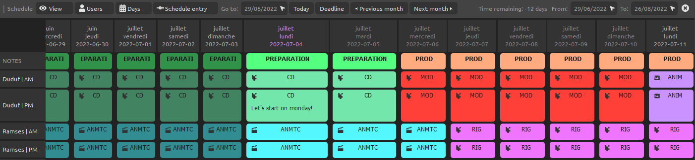
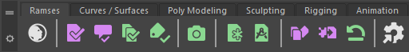

# Ramses - The Rx Asset Management System

!!! warning
    **Ramses is still under active development**, and this documentation is still being written.  

    We strongly invite you to read the [changelog](changelog.md) to know what's going on, and especially to have a look at the [known issues](changelog.md).

## What's this?

*Ramses*, the Rx Asset Management System, is a complete framework to help you, your team, your studio, track the production of your films.

It is meant to be used both by freelancers, small or big teams.

Let's have a look at a few key features.

**▹ [Read the changelog](changelog.md)** to know exactly what's already available and what's planned (along with known issues)

### ▹ Free and open source

*Ramses* is licensed under the GNU General Public License v3, which means **you're free** to do anything you'd like with it, use it the way you want, modify it, and share your modifications.

### ▹ Production Planning

*Ramses* helps you easily **plan your production**, and estimate how long you'll need to produce your project.

For each shot and asset of the project, you'll be able to (automatically) estimate how long it will take to produce, and *Ramses* will keep track of all estimations for you so you can plan accordingly.

[***▸ Read more***](pipeline/planning.md)

### ▹ Production Tracking

At any time, *Ramses* can tell you where you are in the production, how late (or not) you are, and warn you if something's going wrong.

You can **always keep a close (or overall) look at the production**, and check which assets and shots are longer or shorter to produce, and the state in which they are at any time.

[***▸ Read more***](pipeline/production.md)

### ▹ Pipeline automation

In combination with the *Ramses Add-ons* which integrate *Ramses* in your favorite creative software, *Ramses* is able to **automate your pipeline**, managing the **versionning** of the files, the exports, imports and all these manual tasks a robot could do for you.

<figure>
  
  <figcaption>An example: the Autodesk Maya shelf of the Ramses Maya Add-on.</figcaption>
</figure>

With a nice and modern nodal view, it's easy to design your pipeline, connecting each step and setting how the data should go from one step to the other. All this information will be used both by the *Ramses* production tracking algorithms and the *Add-ons* to help you **focus on your real work: creation**.

[***▸ Read more***](pipeline/pipeline.md)

### ▹ (Very) Easy-to-use

A tool like *Ramses* is here to help, not to give you a headache.

All user interface components have been carefully crafted to be beautiful, but most of all to be **intuitive and practical**. Everything has to be clear, precise, and meaningful.

Of course, there's this comprehensive documentation if you have any doubt...

### ▹ And also...

- Why would one want to track one's production from a web browser? *Ramses* comes with its own **native application for _Linux_, _Mac OS_ and _Windows_**. It's designed to by very light and unintrusive, fast and responsive.  
It ususally takes about ten times less memory than a usual web-browser with a single tab opened.

- *Ramses* is **extensible**. Although it already comes with some add-ons for your creative software, if you have specific needs, you can use the provided [*Python* and *Adobe ExtendScript* API](dev/add-ons-reference/index.md), to implement your own *add-ons* which fully integrate with both *Ramses* and your creative applications. The [*Daemon*](dev/daemon-reference/index.md) and the [*Server*](dev/server-reference/index.md) API are also fully documented. And, after all, *Ramses* is open source!

- *Ramses* can [**manage all your files**](#): the idea is that you won't ever need to search for any file through the system's explorer.

### ▹ The future

**_Ramses_ is (far from) not finished**. And probably never will: it is going to evolve, and there are a lot of other planned features and improvements on their way!

**▹ [Read the changelog for more details about what's going on, and known issues](changelog.md)**

Here are some of the features which are not available yet but which will be available in the future.

- The **Dashboard** will be an area where each user accesses all its important data and schedule. It comes with notifications so you won't miss any change concerning your assets, shots and steps.
- **Project Planning**: a simple but indispensable tool to easily plan the production of the project, at the very beginning of the production. With this planning tool you will be able to set the important dates of the production, the deadlines for each step, all in an easy-to-use and visual panel.
- **Status automation**: when a character is rigged, it means it's ready to be animated. Status automation will automatically update the states of all the items according to the pipeline design, and your custom rules.
- **Data export and import**: if you're planning important software update, or for your backups at the end of a production, it may be useful to export and re-import your data.
- **File tools** will provide automatic ways to manage your files, create new assets and shots from already existing files, clean the tree, backup, remove temporary data, batch rename files and folders...
- **Editing tools** to manage your shots from your edits. Automatically set shot duration, order and other metadata by just importing your edit.
- A lot of **UI improvements** and tweaks are planned too, and work will be done to improve the performance of the *Ramses Client Application* even further.
- **_Syncthing_ integration** will provide [a free, open, and secure way to synchronize](https://syncthing.net/) all files and data of your production accross multiple workstations, servers, NAS, etc.

There's also a lot of ongoing work to extend the supported creative applications through *Ramses* Add-ons.

**▹ [Read the *Add-ons* section for a detailed list of existing and planned add-ons](components/addons/index.md)**

## Table of Contents

- Introduction (this page)
- **Principles: the Pipeline & Production Management**
    - [Introduction](pipeline/index.md)
    - [Administration](pipeline/administration.md)
    - [Pipeline](pipeline/pipeline.md)
    - [Production tracking](pipeline/production.md)
    - [Planning](pipeline/planning.md)
- **Ramses Components**
    - [Introduction](components/index.md)
    - The Ramses server
        - [Introduction](components/server/index.md)
        - [How to nstall a web server](components/server/web-server.md)
        - [Installation procedure](components/server/install.md)
        - [Update procedure](components/server/update.md)
        - [Administration](components/server/admin.md)
    - The Ramses application (client)
        - [Introduction](components/client/index.md)
        - [Installation and settings](components/client/install.md)
        - [Administration](components/client/admin.md)
        - [Project settings](components/client/project.md)
        - [The pipeline](components/client/pipeline.md)
        - [Assets and shots production tracking](components/client/production.md)
        - [Schedule and statistics](components/client/schedule.md)
    - Ramses Add-ons
        - [General information](components/addons/index.md)
        - Autodesk Maya
            - [Autodesk Maya Add-on](components/addons/maya.md)
            - [Maya pipeline (publish and import)](components/addons/maya-publish.md)
            - [Extensibility](components/addons/maya-extend.md)
    - The Ramses Tree
        - [Introduction](components/files/index.md)
        - [Naming scheme](components/files/naming.md)
        - [Folder Structure](components/files/tree.md)
- **Extending Ramses, Development**
    - [Introduction](dev/index.md)
    - [Files and folders](dev/files/naming.md)
    - [The Scripting API (Add-ons)](dev/add-ons-reference/index.md)
    - [The Ramses Daemon API](dev/daemon-reference/index.md)
    - [The Ramses Server API](dev/server-reference/index.md)
- **Miscellaneous**
    - [Credits](credits.md)
    - [Changelog](changelog.md)
    - Licenses
        - [Software: GNU GPLv3](licenses/gnu-gpl.md)
        - [Documentation: GNU FDL](licenses/gfdl.md)
        - [Medias: CC BY-NC-SA 4.0](https://creativecommons.org/licenses/by-nc-sa/4.0/)
        
## License

### Software

The software this documentation is referring to is licensed under the ***GNU General Public License***.

**Copyright (C)  2020 Nicolas Dufresne and Contributors.**  
This program is free software; you can redistribute them and/or modify them under the terms of the GNU General Public License as published by the Free Software Foundation; either version 3 of the License, or (at your option) any later version.

This program is distributed in the hope that it will be useful, but WITHOUT ANY WARRANTY; without even the implied warranty of MERCHANTABILITY or FITNESS FOR A PARTICULAR PURPOSE. See the GNU General Public License for more details.

You should have received a copy of the *GNU General Public License* along with this program . If not, see [http://www.gnu.org/licenses/](http://www.gnu.org/licenses/).

{: style="height:75px;"} {: style="height:50px;"}

### Icons and other graphical elements

All graphical elements, especially icons, are from [***RxUI***](http://rxui.rxlab.guide) by Nicolas Dufresne and [RxLaboratory](https://rxlaboratory.org) are licensed under [CC BY-NC-SA 4.0](https://creativecommons.org/licenses/by-nc-sa/4.0/).

**Copyright (C) 2021 Nicolas Dufresne and Contributors.**

[{: style="height:35px;"} {: style="height:35px;"} {: style="height:35px;"} {: style="height:35px;"}](https://creativecommons.org/licenses/by-nc-sa/4.0/)

### This Documentation

**Copyright (C)  2020 Nicolas Dufresne and Contributors.**  
Permission is granted to copy, distribute and/or modify this document under the terms of the GNU Free Documentation License, Version 1.3 or any later version published by the Free Software Foundation;  
with no Invariant Sections, no Front-Cover Texts, and no Back-Cover Texts.
A copy of the license is included in the section entitled "[Documentation License](licenses/gfdl.md)".

{: style="height:75px;"} {: style="height:50px;"}

